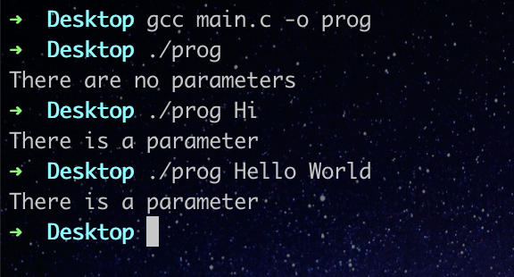

# Main arguments

## (argc, argv)

Why do we use them?

---

> Let’s say we want to create a C program that displays “Hello World !”,  what should we do?
> 

> We can just do this and it works fine:
> 

> (print_str is just a function that takes a string and displays it using write)
> 

> after compilation and execution this is the result :
> 

> Nice, we did it. Now what if we want to display “HELLO WORLD!”, what should we do?
> 

> We need to open the file with a text editor, change the value of str, then recompile and execute it, isn’t that a little bit too much work? What if there’s a simpler way to do it? Actually, there is a way. Using main arguments.
> 
> 
> First of all, let’s change the main function definition.
> 
> Now it takes 2 parameters :
> 

> The first one is argc => its type is int
The second one is argv => its type is char ** which means it's a pointer to char *
and char * is a pointer to char in other words argv is a pointer to pointer to char
> 

# argv

> No how can argv make our previous task easier? As we’ve seen argv points to strings but what strings exactly, the answer is the parameters we enter alongside the executable file in the execution.
> 

> argv allows us to access those parameters using indexes, argv[0] is the executable file argv[1] is the next parameter, and so on.
> 

> This is an example of how to use it
> 

> The result after compilation and execution :
> 

> The utility of argv here is to help us run multiple tests just by executing the code without modifying it.
> 

# argc

> argc is just the number of arguments we entered in the execution including the executable file, which means argc can never be 0 because there's always an executable file but if we are talking about parameters we exclude the executable file.
> 

> Let's write a program that tells us whether we entered a parameter or not, what would it look like?
> 

> After compilation and execution :
> 

> This was a short explanation of one of the utilities of main args, and if you want to dive deeper into them you’ll find a third arg which is envp, and it’s quite interesting.
>